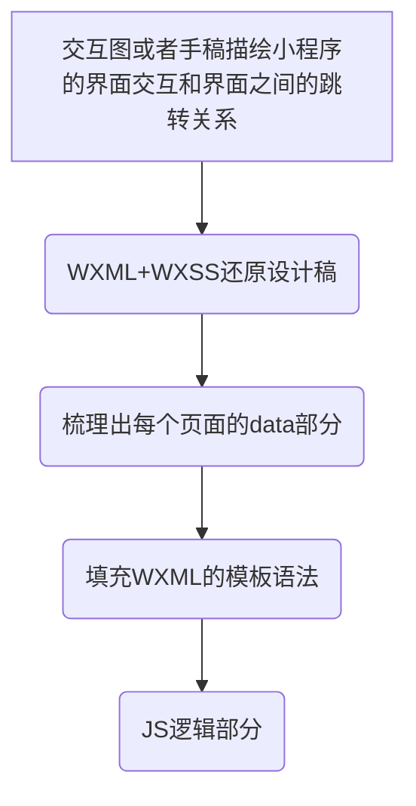

## 七、让小程序往下兼容

```javascript
wx.getSystemInfoSync() 或者 wx.getSystemInfo()
/*
  {
    brand: "iPhone",      // 手机品牌
    model: "iPhone 6",    // 手机型号
    platform: "ios",      // 客户端平台
    system: "iOS 9.3.4",  // 操作系统版本
    version: "6.5.23",    // 微信版本号
    SDKVersion: "1.7.0",  // 小程序基础库版本
    language: "zh_CN",    // 微信设置的语言
    pixelRatio: 2,        // 设备像素比
    screenWidth: 667,    // 屏幕宽度
    screenHeight: 375,     // 屏幕高度
    windowWidth: 667,    // 可使用窗口宽度
    windowHeight: 375,     // 可使用窗口高度
    fontSizeSetting: 16   // 用户字体大小设置
  }
 */
 screenHeight - 导航栏高度 == windowHeight
 // 通过判断API是否存在做兼容
if (wx.openBluetoothAdapter) {
  wx.openBluetoothAdapter()
} else {
  // 如果希望用户在最新版本的客户端上体验您的小程序，可以这样子提示
  wx.showModal({
    title: '提示',
    content: '当前微信版本过低，无法使用该功能，请升级到最新微信版本后重试。'
  })
}
// wx.canIUse()
// 判断接口及其参数在宿主环境是否可用
wx.canIUse('openBluetoothAdapter')
wx.canIUse('getSystemInfoSync.return.screenWidth')
wx.canIUse('getSystemInfo.success.screenWidth')
wx.canIUse('showToast.object.image')
wx.canIUse('onCompassChange.callback.direction')
wx.canIUse('request.object.method.GET')
 // 判断组件及其属性在宿主环境是否可用
wx.canIUse('contact-button')
wx.canIUse('text.selectable')
wx.canIUse('button.open-type.contact')
```

**小程序管理后台 设置 “基础库最低版本设置” ==> 不向前兼容。**
## 八、小程序开发



#### 1. Flex布局
采用flex布局的元素，简称为“容器”（类名：container），容器内的元素简称为“项目”（类名：item）。


[项目是在主轴上排列，排满后在交叉轴方向换行。需要注意的是，交叉轴垂直于主轴，它的方向取决于主轴方向。](https://developers.weixin.qq.com/ebook?action=get_post_info&docid=00080e799303986b0086e605f5680a)
#### 2. 反馈

```html
// 1. 触摸反馈 ==> 让用户感觉到“按下”了
/*page.wxss */
.hover{
  background-color: gray;
}
<!--page.wxml -->
<button hover-class="hover"> 点击button </button>
<view hover-class="hover"> 点击view</view>
// 2. 加载反馈 ==> 让用户感觉这个操作很耗时
<!--page.wxml -->
<button loading="{{loading}}" bindtap="tap">操作</button>
//page.js
Page({
  data: { loading: false },
  tap: function() {
    // 把按钮的loading状态显示出来
    this.setData({
      loading: true
    })
    // 接着做耗时的操作
  }
})
// 3. Toast ==> 显示成功信息
Page({
  onLoad: function() {
    wx.showToast({ // 显示Toast
      title: '已发送',
      icon: 'success',
      duration: 1500
    })
    // wx.hideToast() // 隐藏Toast
  }
})
// 4. 模态对话框 ==> 显示错误信息
Page({
  onLoad: function() {
    wx.showModal({
      title: '标题',
      content: '告知当前状态，信息和解决方法',
      confirmText: '主操作',
      cancelText: '次要操作',
      success: function(res) {
        if (res.confirm) {
          console.log('用户点击主操作')
        } else if (res.cancel) {
          console.log('用户点击次要操作')
        }
      }
    })
  }
})
```

#### 3. 通信

```javascript
wx.request({
  url: 'https://test.com/getinfo',
  success: function(res) {
    console.log(res)// 服务器回包信息
  }
})
```


**注意：**
* url只能是https，域名，该域名要在小程序管理平台配置。
* 开发阶段（开发者工具、小程序的开发版和小程序的体验版）允许wx.request请求任意域名。
* 不能使用ip地址或者localhost，不能带端口号，域名需要ICP备案。
1. get方式请求

```javascript
wx.request({
  url: 'https://test.com/getinfo',
     data: { id:1, version:'1.0.0' },
  success: function(res) {
    console.log(res)// 服务器回包信息
  }
})
```

2. post方式请求
data里面是一个对象a，只是conten-type的application/json值将这个对象转化成了json，所以最终请求过去的数据是json数据：` {"a":{"b":[1,2,3],"c":{"d":"test"}}}`。

```javascript
wx.request({
  url: 'https://test.com/postdata',
  method: 'POST',
  header: { 'content-type': 'application/json'},
  data: {
    a: {
      b: [1, 2, 3],
      c: { d: "test" }
    }
  },
  success: function(res) {
    console.log(res)// 服务器回包信息
  }
})
```


**注意：**
* 要先判断statusCode。
* data字段类型根据响应的header['content-type']决定，默认`header['content-type'] = application/json`。
* 在触发success回调前，小程序宿主环境会对data字段的值做JSON解析，如果解析成功，那么data字段的值会被设置成解析后的Object对象，如果不成功，那就认为data是String类型，值为HTTP响应过来的内容。
3. 超时时间

```javascript
// app.json
{
  "networkTimeout": {
    "request": 3000 // 3000毫秒
  }
}
```

4. 请求的状态反馈
点击一个按钮，界面出现“加载中...”的Loading界面，然后发送一个请求到后台，后台返回成功直接进入下一个业务逻辑处理，后台返回失败或者网络异常等情况则显示一个“系统错误”的Toast，同时一开始的Loading界面会消失。

```javascript
var hasClick = false;
Page({
  tap: function() {
    if (hasClick) {
      return
    }
    hasClick = true
    wx.showLoading()
    wx.request({
      url: 'https://test.com/getinfo',
      method: 'POST',
      header: { 'content-type':'application/json' },
      data: { },
      success: function (res) {
        if (res.statusCode === 200) {
          console.log(res.data)// 服务器回包内容
        }
      },
      fail: function (res) {
        wx.showToast({ title: '系统错误' })
      },
      complete: function (res) {
        wx.hideLoading()
        hasClick = false
      }
    })
  }
})
```

#### 4. 微信登录
将第三服务器的用户id与微信用户id绑定，这样下次用户登录时就可以不用再次输入账号密码，仅凭该用户的微信用户id就可以登录。

```javascript
// page.js
Page({
  tapLogin: function() {
    wx.login({
      success: function(res) {
        if (res.code) {
          wx.request({
            url: 'https://test.com/login',
            data: {
              username: 'zhangsan', // 用户输入的账号
              password: 'pwd123456', // 用户输入的密码
              code: res.code
            },
            success: function(res) {
              // 登录成功
              if (res.statusCode === 200) {         console.log(res.data.sessionId)// 服务器回包内容
              }
            }
          })
        } else {
          console.log('获取用户登录态失败！' + res.errMsg)
        }
      }
    });
  }
})
```


第3步，微信服务器暴露给第三方服务器的接口：`https://api.weixin.qq.com/sns/jscode2session?appid=<AppId>&secret=<AppSecret>&js_code=<code>&grant_type=authorization_code`。
session_key则是微信服务器给开发者服务器颁发的身份凭证，开发者可以用session_key请求微信服务器其他接口来获取一些其他信息，session_key不应该泄露或者下发到小程序前端。
用户登录成功之后，开发者服务器需要生成会话密钥SessionId，在服务端保持SessionId对应的用户身份信息，同时把SessionId返回给小程序。小程序后续发起的请求中携带上SessionId，开发者服务器就可以通过服务器端的Session信息查询到当前登录用户的身份，这样我们就不需要每次都重新获取code，省去了很多通信消耗。
##### 5. 设备能力
扫码、操控蓝牙、获取设备网络状态、调整屏幕亮度等能力。
1. 扫码
wx.scanCode的success回调会收到这个二维码所对应的字符串信息。

```javascript
//page.js
Page({
  // 点击“扫码订餐”的按钮，触发tapScan回调
  tapScan: function() {
    // 调用wx.login获取微信登录凭证
    wx.scanCode({
      success: function(res) {
        var num = res.result // 获取到的num就是餐桌的编号
      }
    })
  }
})
```

2. 获取网络状态

```javascript
//page.js
Page({
  // 点击“预览文档”的按钮，触发tap回调
  tap: function() {
    wx.getNetworkType({
      success: function(res) {
        // networkType字段的有效值：
        // wifi/2g/3g/4g/unknown(Android下不常见的网络类型)/none(无网络)
        if (res.networkType == 'wifi') {
          // 从网络上下载pdf文档
          wx.downloadFile({
url:'http://test.com/somefile.pdf',
            success: function (res) {
              // 下载成功之后进行预览文档
              wx.openDocument({
                filePath: res.tempFilePath
              })
            }
          })
        } else {
          wx.showToast({ title: '当前为非Wifi环境' })
        }
      }
    })
  }
})
```

`wx.onNetworkStatusChange`: 动态监听网络状态变化的接口，让开发者可以及时根据网络状况去调整小程序的体验。

